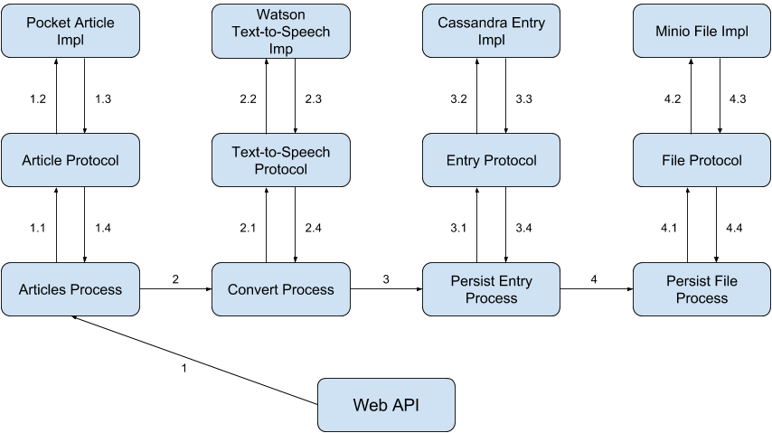
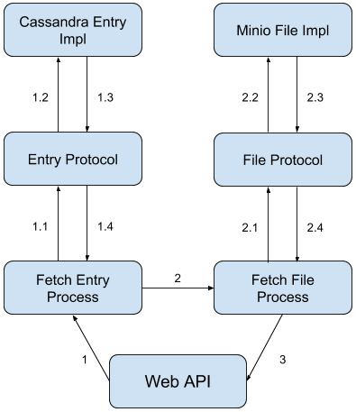

# TalkPocket

## Idea:

* Access Pocket feed from user
* Retrieve text from pocketed articles
* Apply text to speech to said articles using Watson text to speech API
* Clean and save URL entry to Cassandra and associate it with an ID
* Save MP3 file in Minio and associate it with the ID saved in Cassandra 
* Download audio file when Entry ID is requested

## Tools used:

* Clojure:
  * Pedestal
    * https://github.com/pedestal/pedestal
  * Core.async
    * https://github.com/clojure/core.async
  * Pocket:
    * https://getpocket.com/developer/
  * Watson:
    * https://www.ibm.com/watson/developercloud/text-to-speech.html
  * Cassandra:
    * http://cassandra.apache.org/
    * https://hub.docker.com/_/cassandra/
    * http://clojurecassandra.info/
  * Minio:
    * https://www.minio.io
    * https://hub.docker.com/r/minio/minio/
    * https://github.com/minio/minio-java
    * https://github.com/minio/minio-java-rest-example

## Possible Architecture:

### Create Speech Articles:

1. Send API key to fetch articles
   * Request articles and fetch them from service, returns text ready to be converted
2. Send Text and cleaned URL to convert to Speech
   * Send text to be converted to speech
3. Persist entry using URL from it and creating File ID for said entry
   * Create a document containing the Entry ID, URL, User ID and create a File ID from the URL
4. Persist file using File ID
   * Save the MP3 file into File Storage with the File ID

### Fetch Speech Article

1. Send ID of article
   * Fetch entry by ID and respective File ID
2. Fetch File
   * Fetch file by File ID
3. Make file available for download

## Nice to have:
* Websocket endpoint provided
* Simple clojurescript implementation of a Web Listener
* React-native application based on Web Listener
* Use Feedly API
* Unbabel translation: https://unbabel.com/
* GraphQL implementation of the API: https://github.com/graphql-java/graphql-java
